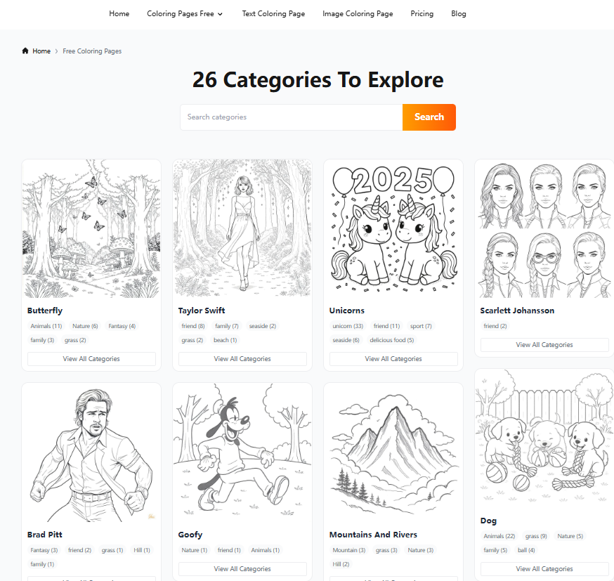
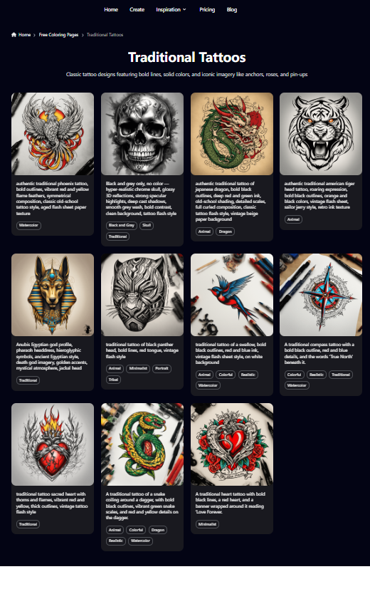

# 🌌 AI Creative Lab — From Failures to Creation

> _"Every fall taught me how to build better."_  

Welcome to **AI Creative Lab**, a collection of my independent AI projects — born from countless experiments, mistakes, and late-night restarts.  
What began as a small side project with **zero traffic** turned into two fully functional AI-powered websites helping creators around the world.

---

## 🧭 The Journey

When I started building my first AI website, I didn’t have a background in SEO, growth, or even much traffic data.  
I just loved the idea of creating something beautiful with AI.

- **💀 First attempt:** Almost no one visited. Sitemap issues, wrong keywords, zero Google indexing.  
- **🌧️ Second phase:** Rebuilt the content system, added blog posts, but still only **7 pages indexed after 3 months**.  
- **🔥 Turning point:** Started tracking analytics, posting on Pinterest & Twitter, and rethinking content like a publisher — not a coder.  
- **🚀 Result:** My new project began to get indexed, generate clicks, and finally… people started creating and sharing AI tattoos & coloring pages.

This lab is a collection of what I learned by falling down — and getting back up.

---

## 🧠 Projects

### 🎨 [ColorPages.art](https://colorpages.art)
**AI Coloring Page Generator**

Born from the frustration of slow indexing, **ColorPages.art** became my testbed for SEO, visual storytelling, and content automation.

- 26+ categories from unicorns to Taylor Swift  
- 200+ AI-generated pages in 90 days  
- Integrated Pinterest & Twitter auto-posts  
- Still improving every week

---

### 🕶️ [AITattoo.art](https://aitattoo.art)
**Free AI Tattoo Generator**

This project came after I learned that “niche clarity” beats “general ambition.”  
Instead of building another AI image site, I focused purely on **tattoo design** — and it worked.

- Unique AI tattoo prompts & blackwork styles  
- Growing organic traffic from blog + Pinterest  
- Serving artists and tattoo fans worldwide  

---
## 🧩 October 14, 2025 – Development Update

1. **Bug Fix – HTTPS Resource Issue on Category Page**  
   Fixed a 404 resource issue on the category page ([https://aitattoo.art/categories](https://aitattoo.art/categories)).  
   The problem was caused by missing HTTPS bindings. After correctly mapping HTTPS to HTTP resources, the issue was resolved.

2. **Feature Update – Category and Tag Name Improvements**  
   Added and corrected several category subpage tag names, such as  
   [Anime Tattoos](https://aitattoo.art/categories/anime-tattoos) and its inner page  
   [Eternal Bonds – Dual Anime Characters](https://aitattoo.art/categories/anime-tattoos/eternal-bonds-dual-anime-characters).

---

## 💡 Web Development Suggestions

- **Optimize Image Loading**  
  Implement lazy loading for image-heavy pages to reduce initial load time and improve Core Web Vitals performance.

- **Add Structured Data (SEO)**  
  Include JSON-LD schema for categories and tattoo artwork pages to enhance search visibility and enable rich snippets in Google Search.

- **Implement Sitemap Automation**  
  Generate and auto-update `sitemap.xml` whenever new categories or artwork pages are published to ensure proper indexation.

- **Improve Page Caching**  
  Use browser and CDN caching strategies (e.g., `Cache-Control` headers, Cloudflare Page Rules) to accelerate repeated visits.

- **Enhance Mobile Responsiveness**  
  Review mobile layout spacing and ensure touch areas (buttons, links) meet accessibility standards.

- **Add Error Monitoring**  
  Integrate tools like Sentry or Vercel Analytics to capture runtime errors and user behavior insights.

- **Enable HTTPS Redirection Globally**  
  Force HTTPS redirection at the server or CDN level to prevent mixed-content issues in the future.

## ⚙️ Tech & Tools Behind the Scenes

- **Frontend:** Next.js + Tailwind CSS  
- **Backend:** Supabase / Vercel  
- **AI Models:** Stable Diffusion, CLIP  
- **Infra:** Cloudflare + Custom Sitemap Automation  
- **Tracking:** GA4 + Cloudflare Analytics + Twitter data  

---

## 🌍 Follow the Journey

- 🐦 [Twitter](https://x.com/AITattooArt)
- 📌 [Pinterest](https://pin.it/6NdatdNmR)

---

> © 2025 AI Creative Lab  
> Built with caffeine, insomnia, and a stubborn belief that small projects can grow big.
